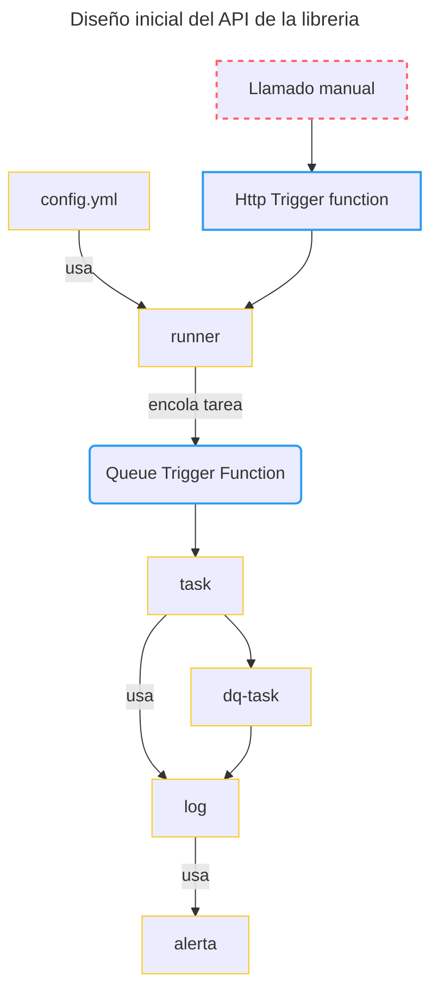

# centraal-dataframework

`centraal-dataframework` es una libreria de python que implementa practicas para usar de manera eficiente [azure function](https://azure.microsoft.com/en-us/products/functions#:~:text=Azure%20Functions%20is%20an%20event,highest%20level%20of%20hardware%20abstraction.) para ejecutar procesos de transformación y calidad de datos. Los procesos de transformación se ejecutan usando la libreria [pandas](https://pandas.pydata.org/) y las reglas de calidad con [great expectations](https://github.com/great-expectations/great_expectations).


## Comienza a usar el framework

Puedes usar tambien a modo de referencia el [notebook](docs/usage_example.ipynb) o seguir los siguientes pasos:

1. Instala la libreria:

    `pip install centraal-dataframework`

2. Asegurar la creación de las siguientes variables de ambiente. En el ambiente desarollo local, es recomendado usar un archivo `.env` y la libreria [python-dotenv](https://pypi.org/project/python-dotenv/). Ya con la function app desplegada estas variables deben estar configuradas en los [Application settings](https://learn.microsoft.com/en-us/azure/azure-functions/functions-how-to-use-azure-function-app-settings?tabs=portal).

    - datalake: nombre de la cuenta de almacenamiento o datalake.
    - datalake_key: key de acceso a la cuenta de almacenamiento o datalake configurado en la anterior variable

3. Crea tus tareas, usando el decorador necesario, cada decorador ofrece objetos que puedes usar para concentrarte en la logica necesaria.

```python
"""---Contenido de other/module/logica_pandas.py---"""
from centraal_dataframework import task

@task
def hello_datalake(datalake, logger):
    """Saluda desde el datalake."""
    source = datalake.read_csv("test/test_framework.csv", sep="|")
    transformed = source.sample(10)
    logger.info(transformed.head(1))
    logger.info("hello there, iam a task")
```

```python
"""---Contenido de other/module/logica_calidad.py---"""
from centraal_dataframework import task_dq

@task_dq
def hello_expectations():
    validator = context.sources.pandas_default.read_csv(
    "https://raw.githubusercontent.com/great-expectations/gx_tutorials/main/data/yellow_tripdata_sample_2019-01.csv"
)
    validator.expect_column_values_to_not_be_null("pickup_datetime")
```
4. Crear el archivo de configuración `yml`

```yml
#---contenido de config.yaml---
logic_app_notificacion: https://logic.app # dejarlo en blanco si no se quiere usar la notificacion
email_notificar: correo@centraal.studio # si no existe logic app esta configuración no se aplica
tareas:
# deben tener el nombre de la función definida.
    hello_datalake:
        horas: 8,12,20
        email_notify: equipo@centraal.soluciones
    hello_expectations:
        horas: 8,12,22
```
5. Crear la function app, adiciona el framework y tareas:

```python
"""---contenido de function_app.py --- """
import azure.functions as func 
from centraal_dataframework.blueprints import framework
# se deben importar los modulos custom
from other.module.logica_pandas import *
from other.module.logica_calidad import *
# si tiene otro modulo tambien importarlo
# form otro.modulo import logica
# ...
app = func.FunctionApp()
#Adicionar el framework
app.register_functions(framework) 

```

6. Desplega la azure function.

## Arquitectura

La arquitectura general de la libreria esta basada en los siguientes servicios:


El diseño inical del API de la libreria se comopone de los siguientes objetos:

1. config.yml
2. runner
3. task
    1. log
    2. alerta
4. dq-task: es un tipo de `task` especifica para reportar tareas de calidad de datos (`dq`).




