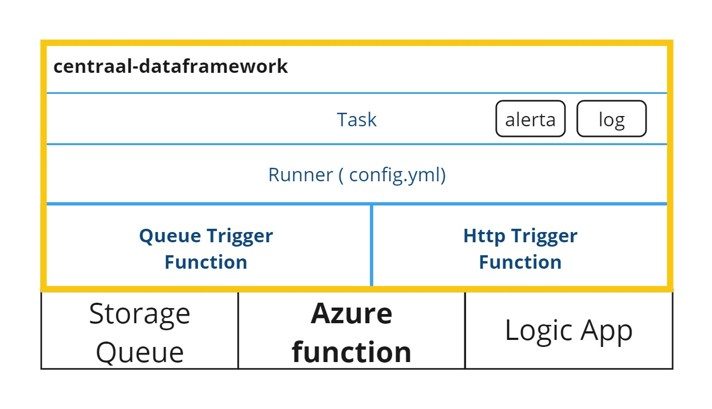
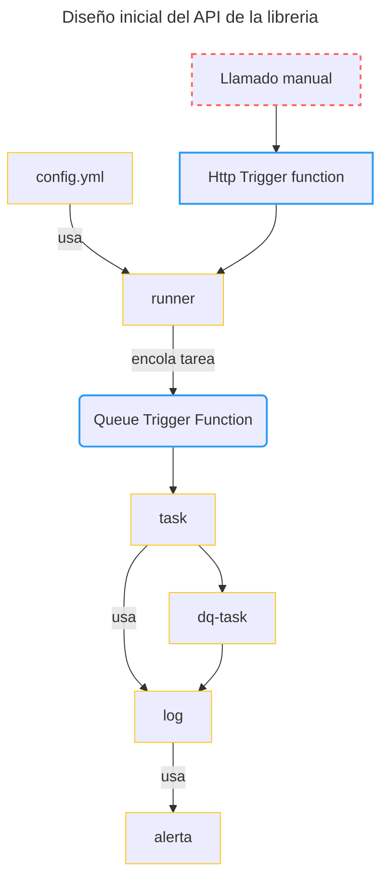

# centraal-dataframework
`centraal-dataframework` es una libreria de python que implementa practicas para usar de manera eficiente [azure function](https://azure.microsoft.com/en-us/products/functions#:~:text=Azure%20Functions%20is%20an%20event,highest%20level%20of%20hardware%20abstraction.) para ejecutar procesos de transformación y calidad de datos. Los procesos de transformación se ejecutan usando la libreria [pandas](https://pandas.pydata.org/) y las reglas de calidad con [great expectations](https://github.com/great-expectations/great_expectations).


## Ejemplo de uso rapido

```python
"""---contenido de function app --- """
import azure.functions as func 
from centraal_dataframework import runner

app = func.FunctionApp() 
app.register_functions(runner) 


"""---Contenido de additional_functions.py---"""
from centraal_dataframework import task
from centraal_dataframework import task_dq
@task
def process_csv():
    info = dl.read_read_csv("contenedor/path/to/csv/file.csv")
    result = info.pipe(flag = 0).groupby('origen')['conteo'].sum()
    dl.to_csv(result)


@task_dq
def aplicar_regla():
    validator = context.sources.pandas_default.read_csv(
    "https://raw.githubusercontent.com/great-expectations/gx_tutorials/main/data/yellow_tripdata_sample_2019-01.csv"
)
    validator.expect_column_values_to_not_be_null("pickup_datetime")


```

## Arquitectura

La arquitectura general de la libreria esta basada en los siguientes servicios:




El diseño inical del API de la libreria se comopone de los siguientes objetos:

1. config.yml
2. runner
3. task
    1. log
    2. alerta
4. dq-task: es un tipo de `task` especifica para reportar tareas de calidad de datos (`dq`).





